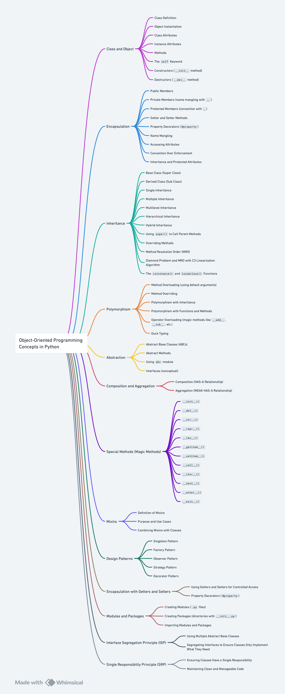

# Python Learning Repository 🐍

**Author:** Prasanna Kumar

This repository covers fundamental and intermediate Python topics, providing a structured learning path for Python enthusiasts. Each section focuses on a specific aspect of Python programming.

## Table of Contents

1. **Basics** 🖥️
   - Introduction to Python and basic concepts.
  
2. **Lists** 📋
   - Understanding lists and their usage in Python.

3. **Tuples** 📦
   - Exploring tuples and their characteristics.

4. **Dictionaries** 🗃️
   - Understanding dictionaries and their applications.
  
5. **Sets** 🧮
   - An introduction to sets in Python and their usage.

6. **Strings** 📝
   - Manipulating and working with strings in Python.

7. **Collections** 🗂️
   - Overview of Python's collection modules (e.g., `collections`).

8. **Itertools** 🔁
   - Understanding the `itertools` module for efficient iteration.

9. **Lambda Functions** 💼
   - Introduction to lambda functions for functional programming.

10. **Exceptions and Errors** ❌
   - Handling exceptions and errors in Python.

11. **Logging** 📜
   - Utilizing the logging module for effective logging practices.

12. **JSON** 🧾
   - Working with JSON data in Python.

13. **Random Numbers** 🎲
   - Generating random numbers in Python.

14. **Decorators** 🎨
   - Understanding and using decorators in Python.

Feel free to explore each topic in detail, and don't hesitate to contribute or provide feedback. Happy learning in the Python world!

Principles:
SRP, OCP, LSP, DIP, DI
Patterns:
Factory Pattern, Singleton Pattern, Repository Pattern
Encapsulation:
Private, Protected, Public Attributes
Core OOP Concepts:
Abstraction, Inheritance, Polymorphism, Object Composition
Additional Concepts:
DTOs, Decorators

## OOPS Concepts:

# Python OOP Concepts

This repository contains Jupyter notebooks covering various Object-Oriented Programming (OOP) concepts in Python. The notebooks are organized into categories such as Principles, Patterns, Encapsulation types, Core OOP Concepts, and Additional Concepts.

## Principles

### Single Responsibility Principle (SRP)
- **Notebook**: [Single_Responsibility_Principle.ipynb](Python_oops_concepts/Single_Responsibility_Principle.ipynb)
- **Description**: This principle states that a class should have only one reason to change, meaning that a class should only have one job or responsibility.

### Open/Closed Principle (OCP)
- **Notebook**: [Open_Closed_Principle_(OCP).ipynb](Python_oops_concepts/Open_Closed_Principle_(OCP).ipynb)
- **Description**: This principle states that software entities should be open for extension but closed for modification.

### Liskov Substitution Principle (LSP)
- **Notebook**: [Liskov_Substitution_Principle_(LSP).ipynb](Python_oops_concepts/Liskov_Substitution_Principle_(LSP).ipynb)
- **Description**: This principle states that objects of a superclass should be replaceable with objects of a subclass without affecting the functionality.

### Dependency Inversion Principle (DIP)
- **Notebook**: [Dependency_Inversion_Principle_(DIP).ipynb](Python_oops_concepts/Dependency_Inversion_Principle_(DIP).ipynb)
- **Description**: This principle states that high-level modules should not depend on low-level modules. Both should depend on abstractions.

### Dependency Injection (DI) Principle
- **Notebook**: [Dependency_Injection_(DI)_principle.ipynb](Python_oops_concepts/Dependency_Injection_Principle(DI).ipynb)
- **Description**: Dependency Injection is a technique where one object supplies the dependencies of another object.

## Patterns

### Factory Pattern
- **Notebook**: [Factory_pattern.ipynb](Python_oops_concepts/Factory_pattern.ipynb)
- **Description**: The Factory pattern is used to create objects without specifying the exact class of the object that will be created.

### Singleton Pattern
- **Notebook**: [Singleton_pattern.ipynb](Python_oops_concepts/Singleton_pattern.ipynb)
- **Description**: The Singleton pattern ensures that a class has only one instance and provides a global point of access to it.

### Repository Pattern
- **Notebook**: [Repository_Pattern.ipynb](Python_oops_concepts/Repository_Pattern.ipynb)
- **Description**: The Repository pattern mediates between the domain and data mapping layers, acting like an in-memory domain object collection.

## Encapsulation

### Encapsulation (Private Attribute)
- **Notebook**: [Encapsulation_private_attribute.ipynb](Python_oops_concepts/Encapsulation_private_attribute.ipynb)
- **Description**: Encapsulation using private attributes hides the internal state of an object and only allows access through public methods.

### Encapsulation (Protected Attribute)
- **Notebook**: [Encapsulation_protected_attribute.ipynb](Python_oops_concepts/Encapsulation_protected_attribute.ipynb)
- **Description**: Encapsulation using protected attributes allows access within the same package or subclasses.

### Encapsulation (Public Attribute)
- **Notebook**: [Encapsulation_public_attribute.ipynb](Python_oops_concepts/Encapsulation_public_attribute.ipynb)
- **Description**: Encapsulation using public attributes allows unrestricted access to the attribute.

## Core OOP Concepts

### Abstraction
- **Notebook**: [Abstraction.ipynb](Python_oops_concepts/Abstraction.ipynb)
- **Description**: Abstraction involves hiding complex implementation details and showing only the necessary features of an object.

### Inheritance
- **Notebook**: [Inheritance.ipynb](Python_oops_concepts/Inheritance.ipynb)
- **Description**: Inheritance allows a new class to inherit the properties and methods of an existing class.

### Polymorphism
- **Notebook**: [Polymorphism.ipynb](Python_oops_concepts/Polymorphism.ipynb)
- **Description**: Polymorphism allows objects of different classes to be treated as objects of a common superclass, typically using methods to perform different tasks based on the object’s class.

### Object Composition
- **Notebook**: [Object_Composition.ipynb](Python_oops_concepts/Object_Composition.ipynb)
- **Description**: Object Composition is a design principle where objects are composed of other objects to achieve functionality.

## Additional Concepts

### Data Transfer Objects (DTOs)
- **Notebook**: [Data_Transfer_Objects_(DTOs).ipynb](Python_oops_concepts/Data_Transfer_Objects_(DTOs).ipynb)
- **Description**: DTOs are objects that carry data between processes to reduce the number of method calls.

### Decorators
- **Notebook**: [Decorators.ipynb](Python_oops_concepts/Decorators.ipynb)
- **Description**: Decorators are a design pattern in Python that allows a user to add new functionality to an existing object without modifying its structure.

---

This repository serves as a comprehensive resource for understanding and implementing key OOP concepts in Python. Each notebook provides detailed explanations, examples, and code snippets to help you grasp these fundamental principles and patterns.
